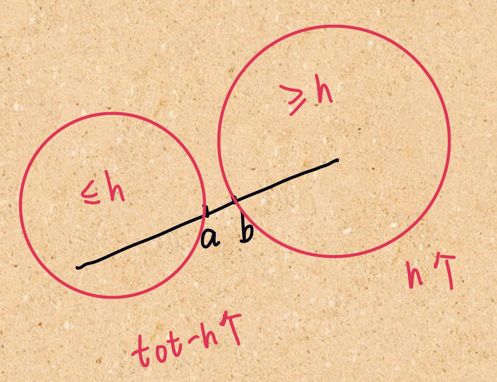

# 275. H-Index II

> Given an array of citations **sorted in ascending order** (each citation is a non-negative integer) of a researcher, write a function to compute the researcher's h-index.
>
> According to the [definition of h-index on Wikipedia](https://en.wikipedia.org/wiki/H-index): "A scientist has index *h* if *h* of his/her *N* papers have **at least** *h* citations each, and the other *N − h* papers have **no more than** *h* citations each."
>
> **Example:**
>
> ```
> Input: citations = [0,1,3,5,6]
> Output: 3 
> Explanation: [0,1,3,5,6] means the researcher has 5 papers in total and each of them had 
>              received 0, 1, 3, 5, 6 citations respectively. 
>              Since the researcher has 3 papers with at least 3 citations each and the remaining 
>              two with no more than 3 citations each, her h-index is 3.
> ```
>
> **Note:**
>
> If there are several possible values for *h*, the maximum one is taken as the h-index.
>
> **Follow up:**
>
> - This is a follow up problem to [H-Index](https://leetcode.com/problems/h-index/description/), where `citations` is now guaranteed to be sorted in ascending order.
> - Could you solve it in logarithmic time complexity?

由于数组已经排好序，考虑二分。如下图，若$a\le h\le b$，则$h$符合要求；若$a>h$，则$h$应增大；若$b<h$，则$h$应减小。



我们对$b$的下标$idx$进行二分，代码如下：

```python
class Solution:
    def hIndex(self, citations: List[int]) -> int:
        L = 0
        R = tot = len(citations)
        ret = 0
        while L < R:
            idx = (L + R) // 2
            h = tot - idx
            if idx > 0 and citations[idx - 1] > h:
                R = idx
            elif citations[idx] < h:
                L = idx + 1
            else:
                R = idx
                ret = h
        return ret
```

