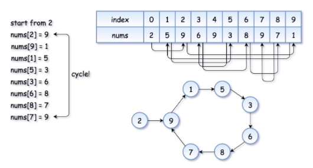
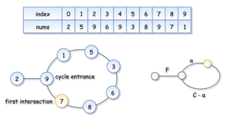

# 287. Find the Duplicate Number

> Given an array of integers `nums` containing `n + 1` integers where each integer is in the range `[1, n]` inclusive.
>
> There is only **one repeated number** in `nums`, return *this repeated number*.
>
>  
>
> **Example 1:**
>
> ```
> Input: nums = [1,3,4,2,2]
> Output: 2
> ```
>
> **Example 2:**
>
> ```
> Input: nums = [3,1,3,4,2]
> Output: 3
> ```
>
> **Example 3:**
>
> ```
> Input: nums = [1,1]
> Output: 1
> ```
>
> **Example 4:**
>
> ```
> Input: nums = [1,1,2]
> Output: 1
> ```
>
>  
>
> **Constraints:**
>
> - `2 <= n <= 3 * 104`
> - `nums.length == n + 1`
> - `1 <= nums[i] <= n`
> - All the integers in `nums` appear only **once** except for **precisely one integer** which appears **two or more** times.
>
>  
>
> **Follow up:**
>
> - How can we prove that at least one duplicate number must exist in `nums`?
> - Can you solve the problem **without** modifying the array `nums`?
> - Can you solve the problem using only constant, `O(1)` extra space?
> - Can you solve the problem with runtime complexity less than `O(n^2)`?

方法一：先排序，然后遍历。时间复杂度 O(nlogn)，空间复杂度 O(1)。代码如下：

```python

class Solution:
    def findDuplicate(self, nums: List[int]) -> int:
        nums.sort()
        for i in range(1, len(nums)):
            if nums[i] == nums[i-1]:
                return nums[i]
        return -1
```

方法二：利用 set 数据结构判断当前元素是否出现过，时间复杂度 O(n)，空间复杂度 O(n)。代码如下：

```python
class Solution:
    def findDuplicate(self, nums: List[int]) -> int:
        mem = set()
        for num in nums:
            if num in mem:
                return num
            else:
                mem.add(num)
        return -1
```

方法三：Floyd's Tortoise and Hare (Cycle Detection)。将问题转化为寻找有环链表中环的入口的问题，如图：



该算法利用双指针`tortoise`和`hare`，分为两个步骤：

1. 首先，两个指针以各自的速度前进，慢指针`tortoise`每次前进一步，快指针`hare`每次前进两步，直到两个指针相遇。如图，我们设环的入口距离起点 F 个步长单位，相遇点距离入口 a 个步长单位，环的长度为 C 个步长单位。`tortoise`走过的路程应是`hare`走过路程的一半，于是有等量关系：$2 ( F + a ) = F + nC + a$，即$F+a=nC$。

   

2. 接下来，`tortoise`重新从起点出发，`hare`继续从相遇点出发，两个指针均每次前进一步，直到再次相遇。由于$F+nC+a+F=F+n'C$，故经过 F 步后，两个指针相遇，且相遇点距离起点 F 个步长单位，即环的入口点。

   

   代码如下：

   ```python
   class Solution:
       def findDuplicate(self, nums: List[int]) -> int:
           tortoise = 0
           hare = 0
           while True:
               hare = nums[hare]
               tortoise = nums[nums[tortoise]]
               if hare == tortoise:
                   break
           tortoise = 0
           while True:
               hare = nums[hare]
               tortoise = nums[tortoise]
               if hare == tortoise:
                   break
           return hare
   ```

   


