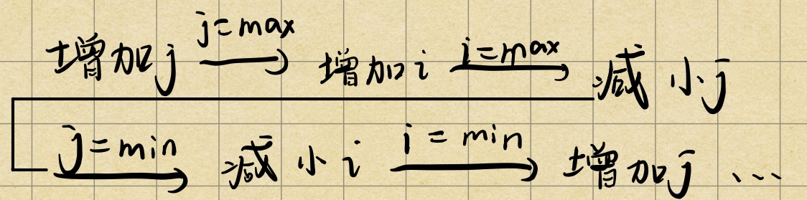

# 54. Spiral Matrix

> Given a matrix of *m* x *n* elements (*m* rows, *n* columns), return all elements of the matrix in spiral order.
>
> **Example 1:**
>
> ```
> Input:
> [
>  [ 1, 2, 3 ],
>  [ 4, 5, 6 ],
>  [ 7, 8, 9 ]
> ]
> Output: [1,2,3,6,9,8,7,4,5]
> ```
>
> **Example 2:**
>
> ```
> Input:
> [
>   [1, 2, 3, 4],
>   [5, 6, 7, 8],
>   [9,10,11,12]
> ]
> Output: [1,2,3,4,8,12,11,10,9,5,6,7]
> ```

按如下步骤：



代码如下：

```python
class Solution:
    def spiralOrder(self, matrix: List[List[int]]) -> List[int]:
        if len(matrix) == 0:
            return []
        row_min = 0
        row_max = len(matrix) - 1
        col_min = 0
        col_max = len(matrix[0]) - 1
        result = []
        count = 0
        amount = len(matrix) * len(matrix[0])
        while count < amount:
            i = row_min
            j = col_min
            while j <= col_max and count < amount:
                result.append(matrix[i][j])
                count += 1
                j += 1
            j = col_max
            row_min += 1
            i = row_min
            
            while i <= row_max and count < amount:
                result.append(matrix[i][j])
                count += 1
                i += 1
            i = row_max
            col_max -= 1
            j = col_max
            
            while j >= col_min and count < amount:
                result.append(matrix[i][j])
                count += 1
                j -= 1
            j = col_min
            row_max -= 1
            i = row_max
            
            while i >= row_min and count < amount:
                result.append(matrix[i][j])
                count += 1
                i -= 1
           
            col_min += 1
        return result
```

